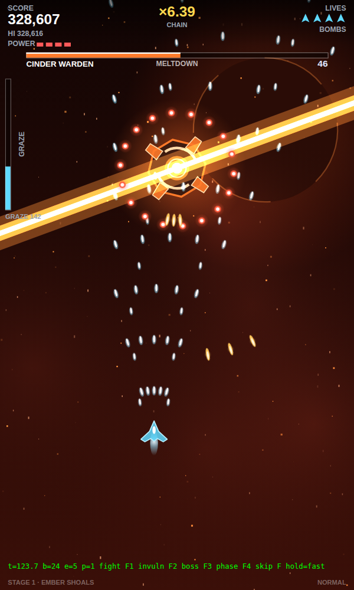
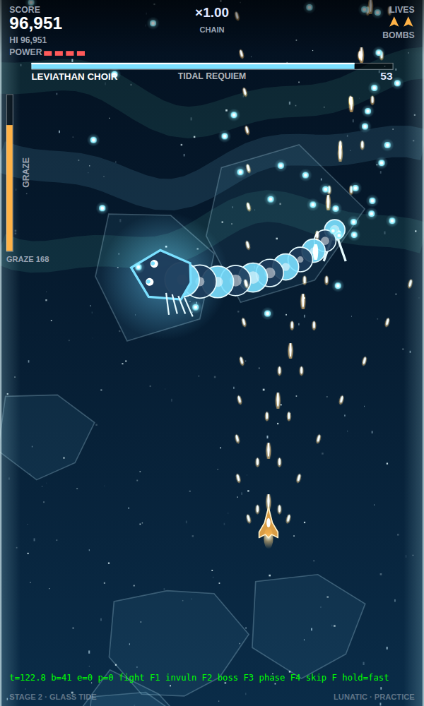
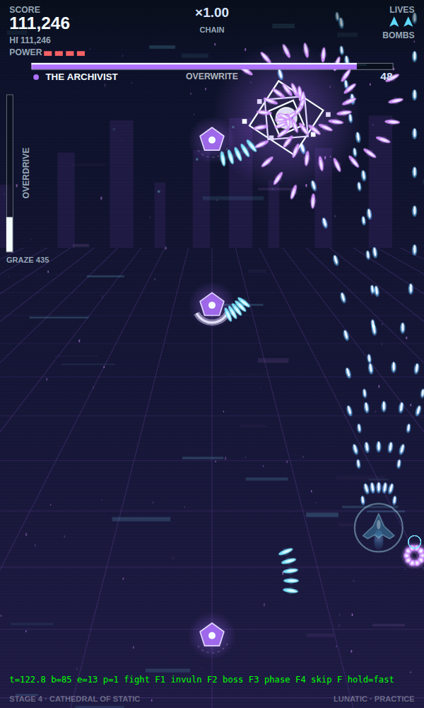
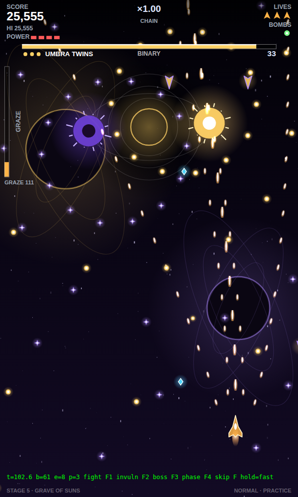

# 🔥 HOLLOW CHOIR — a bullet hell in seven verses

> **▶ PLAY IT:** the whole game is **one file: [`bullethell/index.html`](bullethell/index.html)**.
> Download it and double-click it (works straight from disk, no server needed), or on GitHub Pages open
> **`https://<your-username>.github.io/Video-Game-1/bullethell/`**.
> Phone: portrait, drag to move, on-screen buttons. Laptop: keyboard (or drag with the mouse/trackpad). Headphones recommended.

A complete, top-down (vertical) bullet hell. Seven worlds, each with its own **rule of play**, palette, generative soundtrack, enemy roster and multi-phase boss. Three ships, three difficulties, relics between worlds, graze-powered Overdrive, death-bombing, practice mode, high scores, touch + gamepad support.

| # | World | Its rule | Boss |
|---|---|---|---|
| 1 | **Ember Shoals** | Drifting rock is cover for both sides. Shatter it for gems, mind the shards. | **Cinder Warden** — slag spirals, cinder rain, furnace blooms, twin rotating meltdown lasers |
| 2 | **Glass Tide** | The ice walls *reflect* bullets. A needle that misses tries again. | **Leviathan Choir** — an eleven-segment serpent; waves, frost breath, shatter song, tidal requiem |
| 3 | **The Bloom** | Spore clouds slow your hull. Seeds ripen into rings. | **Mother Root** — pollen drift, seedbursts, five rotating vine lasers, full bloom |
| 4 | **Cathedral of Static** | Telegraphed laser grids. Shielded knights open for a moment. Glitching bullets. | **The Archivist** — index curtains, redaction grids, corruption, ambush rings, null sweep |
| 5 | **Grave of Suns** | Gravity wells bend every bullet, and tug you. | **Umbra Twins** — two orbiting stars: binary rings, eclipse, a tidal-lock link laser, supernova |
| 6 | **Hourglass Reach** | Amber bubbles slow bullets inside them. Stand in stopped time. | **Chronarch** — second hand, echoes of your own path, rewinding knives, the stopped hour |
| 7 | **The Choir's Heart** | Everything fires on the beat. Every pulse pushes the bullets. | **The Choir** — six phases that reprise every world, then *Silence* |

**Controls** — arrows/WASD move · auto-fire (or Z/SPACE) · SHIFT focus (shows hitbox) · X bomb · C overdrive · ESC pause. Touch: drag anywhere to move, on-screen BOMB / OVER / FOCUS. Gamepad: stick, A fire, B bomb, X/Y overdrive, triggers focus.

**Systems** — graze bullets to fill **Overdrive** (bullets crawl, damage spikes) · a ×chain that grows with kills and grazes and halves on death · per-phase boss timers with *silenced* bonuses for clean clears · death-bomb window · power levels · extends · **Relics** (ten run-long upgrades, pick one of three after each world) · Novice / Normal / Lunatic (Lunatic clear = +1,000,000) · practice any world you have reached · saved scores, stats and options.

```
bullethell/index.html      THE GAME — single self-contained file (generated, do not edit by hand)
bullethell/dev.html        same shell loading the ES modules below, for development
tools/build-bullethell.mjs bundles dev.html + src/*.js into index.html
bullethell/src/main.js     loop, state machine, collisions, stage flow
bullethell/src/levels.js   the seven worlds: palettes, music, dialogue, mechanics, wave scripts
bullethell/src/bosses.js   boss framework + seven bosses (30 phases)
bullethell/src/patterns.js ring / fan / spiral / seed / curtain / laser pattern library
bullethell/src/player.js   three hulls, bombs, overdrive, relics
bullethell/src/audio.js    step-sequenced synth music per world + SFX (no audio files)
test/bullethell-smoke.mjs  headless Playwright run through all seven worlds
```

<p align="center">   </p>

Build after editing sources: `node tools/build-bullethell.mjs`. Smoke test (runs the built file): `node test/bullethell-smoke.mjs` (add `--quick` for world 1 only). Screenshots land in `test/bh-shots/`.

---

# ⚔️ ELDERFALL — A Tale of Emberhollow

An **open-world, first-person fantasy RPG that runs in your phone's browser**. No install, no app store — just open the link and play. Inspired by Skyrim, The Witcher 3, and Middle-earth.

> **▶ PLAY IT:** enable GitHub Pages for this repo (Settings → Pages → Source: *GitHub Actions*), push, and open
> **`https://<your-username>.github.io/Video-Game-1/`** on your phone.
> Or run locally: `npx serve .` and open the URL. (The game is plain static files — any web server works.)

Best experienced **fullscreen, landscape, with headphones**. There's a fullscreen button in the pause menu (⚙).

---

## 🗺️ The World

A hand-seeded realm you can walk end to end — and always, on the northern horizon, the mountain **Drakespire**, where something with wings is waiting.

| Place | What awaits |
|---|---|
| **Emberhollow** | Your village. Five townsfolk with troubles of their own, an inn, a forge, warm windows at night. |
| **Greywatch Tower** | The beacon has gone dark. Someone should find out why. |
| **Barrowdeep Ruins** | A crypt beneath broken arches. The dead keep an old king's sword. |
| **The Wardstones** | A stone circle whose wards have failed. Cleanse it — at night, if you dare. |
| **Redfang Camp** | Bandits, and their lord **Vargr Redfang** — who *remembers* every time he kills you, and returns stronger and scarred. |
| **Mirrormere** | A cold lake with a lost keepsake beneath its docks. |
| **Drakespire** | The end of the road. Bring Aldric's blade. |

Plus wolves in the pines, goblins in the rocks, chests and cairns and cart wrecks tucked along every path.

## 🎮 Controls

**Phone** — left thumb: floating joystick · right thumb: look · big button: attack (hold = heavy) · shield: block/parry · radial button: **weapon wheel** (time slows) · contextual pill: interact.

**Desktop** — WASD + mouse (click to capture) · LMB attack · RMB block · **Q** weapon wheel · **E** interact · **1–6** hotkeys · **J** journal · **Esc** menu.

## ✨ Features

- **Real CC0 art**: professionally rigged KayKit characters (75 animations each), 400+ building/dungeon/cemetery props, all repainted with a dark-fantasy grade — plus a dense procedural wilderness (50+ tree, bush, and rock varieties in seeded groves, fallen logs, glowing mushrooms)
- Full **day/night cycle** with long golden hours, dark dangerous nights, aurora some nights over Drakespire, shooting stars, fog-shrouded distance
- **State-of-the-art combat**: 8-weapon wheel with bullet-time (sword · axe · greatsword · bow · fire · frost · chain lightning · heal), dodge rolls with i-frames, perfect-dodge slow-mo, 3-hit combos, Mordor-style counter prompts, kill-cam finishers, hitstop + parry sparks
- **16+ enemy types**: wolves, goblins, bandits, skeletons & archers, wraiths, werewolves (night forests), vampire thralls, trolls, witches, elite variants with names — plus bosses: the Barrowlord, vampire lord Morvane, the nemesis Vargr Redfang who *remembers killing you*, and the drake Vhastrix
- **Blacksmithing & enchanting**: 4 weighty upgrade tiers at Torvald's forge (each visually altering your weapon), 5 school enchants with glowing blades at the cleansed Wardstones, hidden spell tomes that upgrade your magic
- **Global economy**: 5 vendors with daily price moods + a wandering merchant, mining veins, materials & valuables, village reputation discounts
- **Learn-by-doing skills** (Skyrim-style, less grind): 6 skills leveled by use, 48-perk constellation trees, playstyle-changing capstones
- **Endless endgame**: the whole world scales with you (encounter design makes danger zones dangerous — never stat walls), daily Hunt Board bounties, Blood Moon village sieges, and the Trial of Echoes boss rematches
- **Living world**: 45+ ambient micro-details — ants on logs, creaking inn signs, a noon bell, moths at windows, chickens, the answered wolf howl at night, a villager who feeds the hens at dawn
- **16 readable lore books**, a bestiary, buried treasure, secrets, physics props you can send flying
- **Voiced dialogue** (system speech synthesis, per-character voices) + generative music & 100% synthesized audio
- 5-act main quest + 6 side quests with real choices and consequences
- **Save/load** (autosaves every minute), quality toggle, adaptive resolution

## 🛠️ Tech

Plain ES modules + [three.js](https://threejs.org) r160 (vendored, MIT license). No build step, no bundler, no assets. Chunked vertex-colored terrain with LOD + a static far shell, global InstancedMesh vegetation pools, shader sky dome, fresnel water, pooled particles/projectiles, WebAudio synthesis — tuned for ~60fps on mid-range phones (≤120 draw calls, ACES tone mapping, capped DPR with dynamic resolution).

```
index.html         shell + title screen
src/core.js        seeded noise, terrain function, POIs, event bus  ← single source of truth
src/main.js        boot, game loop, hitstop/slow-mo, adaptive resolution
src/world.js       terrain chunks, far shell, vegetation, water
src/sky.js         sky shader, sun/moon/stars/clouds, lighting, fog
src/player.js      first-person controller, stats, leveling
src/combat.js      weapons, viewmodel, projectiles, loot, particles
src/enemies.js     AI, procedural monsters, bosses, the nemesis
src/structures.js  village, ruins, tower, camp, chests
src/quests.js      NPCs, dialogue, quest chain
src/ui.js          HUD, touch controls, weapon wheel, menus
src/audio.js       procedural SFX + generative music
src/save.js        localStorage persistence
```

Dev: `node test/smoke.mjs` boots the game headless and screenshots it.
