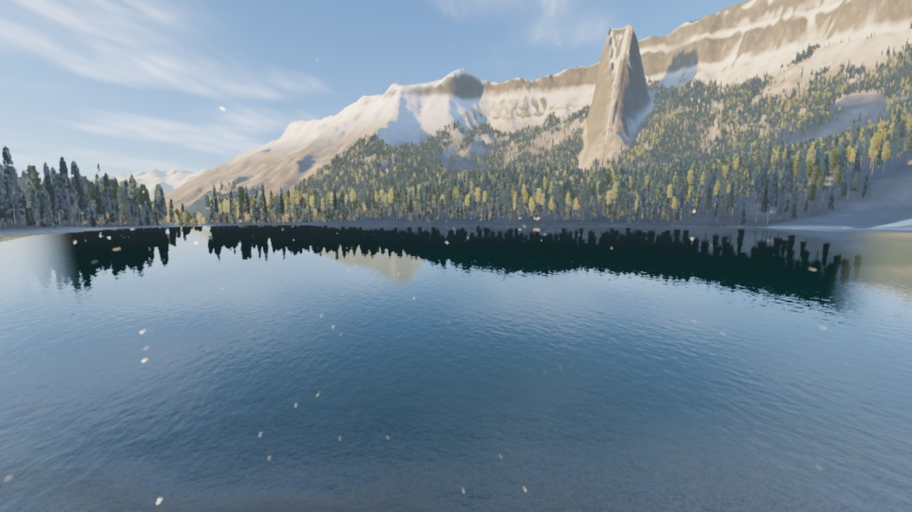
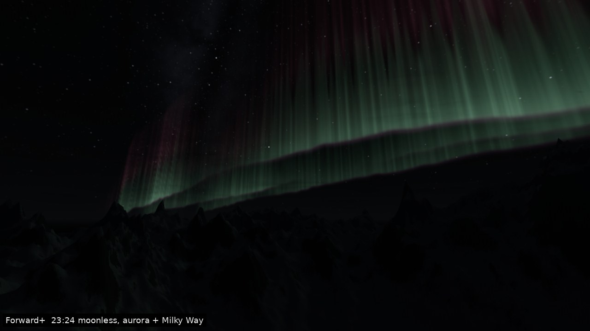

# THIN AIR

*A first-person survival game set high in the mountains of northern British Columbia.*
Subnautica's awe and dread of the unknown, with altitude instead of depth. Sons of the Forest's hands-on
survival: chop real trees, build a log shelter, cook on an open fire. Everything grounded and realistic.



Your bush plane goes down in a storm in the remote Aldous Range. You wake in the wreck at dusk, snow falling,
with a dead pilot and a radio that still hears a weak beacon from Kestrel Station, a glaciology station on the col
below Mount Corrigan (3,452 m). Somebody up there is still alive. Getting to her means surviving the valley, the
forest, an abandoned gold mine, the glacier and the icefall, and finally the summit itself.

## Play it

Every push to this branch builds the game and publishes it on the repository's
**Releases** page as **`thin-air-preview`** (tag `thin-air-preview`).

| Device | Download | Install |
|---|---|---|
| **Samsung Galaxy S25 Ultra** | `ThinAir-Android-arm64.apk` | Open the release page on the phone, download the APK, allow your browser to install unknown apps, open it. Play in landscape, headphones recommended. If an older preview is installed and the update is refused, uninstall it first (preview builds are signed with a throwaway key). |
| **MSI Cyborg 15 (Windows)** | `ThinAir-Windows-x64.zip` | Extract anywhere, run `ThinAir.exe` (keep `ThinAir.pck` next to it). SmartScreen: *More info → Run anyway*. The game auto-detects the RTX GPU and picks the *High* preset. |
| Linux | `ThinAir-Linux-x64.tar.gz` | Extract, run `ThinAir.x86_64`. |

Graphics presets are chosen automatically (Adreno 7xx/8xx phones → *Mobile High*, RTX laptops → *High*) and
can be changed in **Settings**. The phone uses Godot's Mobile renderer with MSAA and dynamic resolution
targeting 60 fps; the laptop uses Forward+ with volumetric fog, SSAO and TAA.

## Controls

| Action | Keyboard / mouse | Gamepad | Touch |
|---|---|---|---|
| Move / look | WASD / mouse | Left stick / right stick | Floating left stick / drag right side |
| Sprint · crouch · jump | Shift · C · Space | L3 · B · A | Push stick to edge · buttons |
| Use tool / attack | Left mouse | RT | Use button (hold) |
| Aim / alternate | Right mouse | LT | Aim button |
| Interact (hold for timed) | E | X | Context pill |
| Inventory & crafting | Tab / I | Y | Bag button |
| Hotbar | 1–6, mouse wheel | LB / RB | Hotbar strip |
| Build mode | B | D-pad up | Hammer button |
| Journal / map | J / M | View / D-pad down | Journal / map buttons |
| Torch | F | D-pad right | Torch button |
| Pause | Esc | Start | Pause button |

## How to survive

- **Warmth** falls with altitude (−6.5 °C per 1,000 m), wind, wet clothes and night. Fire, shelter, clothing and
  hot food bring it back. Above the treeline there is no firewood.
- **Oxygen** drops above 2,800 m. Rest, descend, or breathe from an O2 bottle once the station's concentrator runs.
- **Food and water**: hunt, forage, cook, boil snow. Untreated water can make you sick.
- **Gear gates the mountain**: crampons and an ice axe for the icefall, insulation for the glacier, oxygen for the
  summit. Scan things with the survey scanner and read what the crew left behind to learn blueprints.
- **Wolves** hunt in packs at dusk and at night and fear fire. There is also a very old grizzly near the mine.

## What's in it

- A 3 × 3 km hand-designed, erosion-simulated mountain (1,300 → 3,452 m) with glacier, icefall, lakes, a braided
  river, waterfalls and 12 story locations, surrounded by distant ranges.
- A physically based sky: 56° N sun path, moon phases, Milky Way, aurora, clouds, valley fog, snow and blizzards,
  plus a real temperature and wind-chill model.
- Blender-made conifers (spruce, fir, lodgepole, whitebark pine, golden larch) with impostors, choppable trees,
  shrubs, grass and rocks.
- Survival: 6 vitals and status effects, 109 items, 45 recipes, 22 buildable log structures, storage, sleeping.
- Wildlife: wolf packs, grizzly (and Old Grey), mule deer, mountain goats, snowshoe hares, ravens and eagles, driven
  by sight, hearing and scent carried on the wind.
- A six-act story with a voiced radio companion, crew logs, 30 objectives and a rescue ending.
- An original adaptive score (10 cues + stingers), 126 synthesized sound effects with variations, layered ambience.



## How it was made

Everything in the game is original and was generated in this repository. Nothing was downloaded from asset stores.

- **Godot 4.7** (GDScript): Forward+ on desktop, Mobile renderer on Android.
- **Blender** (Python, headless): trees, rocks, creatures with rigs and baked animation, tools, first-person
  hands, props and all story architecture.
- **Python / C**: terrain generation with hydraulic and thermal erosion, PBR texture synthesis, physically
  modelled sound effects.
- **Music**: composed note by note in code, rendered through FluidSynth with the MuseScore General soundfont,
  mixed with a synthesized hall reverb.
- **Voices**: Piper neural text-to-speech (LibriTTS voices, CC BY 4.0), processed as radio and dictaphone audio.

See [`DESIGN.md`](DESIGN.md) for the game design, [`CONTRACT.md`](CONTRACT.md) for the engineering contract,
[`tools/README.md`](tools/README.md) for every asset generator, [`docs/perf.md`](docs/perf.md) for performance
budgets and measurements, and [`assets/CREDITS.md`](assets/CREDITS.md) for licences.

## Building from source

```sh
godot --headless --path thin-air --import                    # Godot 4.7.2
godot --headless --path thin-air res://tests/test_runner.tscn -- --test=res://tests/test_core.gd
godot --headless --path thin-air --export-release "Windows Desktop" build/windows/ThinAir.exe
godot --headless --path thin-air --export-release "Android" build/android/ThinAir.apk   # needs a keystore, see .github/workflows/thin-air.yml
```

The CI workflow in `.github/workflows/thin-air.yml` shows the complete build.
